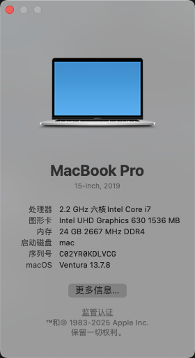

# Lenovo Legion Y7000 Hackintosh EFI

联想拯救者 Y7000 2018 款 黑苹果 OpenCore 引导配置

  

## 硬件配置

| 硬件组件 | 型号 |
|---------|------|
| 电脑型号 | Lenovo Legion Y7000 |
| 处理器 | Intel Core i7-8750H |
| 显卡 | Intel UHD 630 + NVIDIA GTX 1050Ti |
| 内存 | DDR4 2666MHz |
| 存储 | NVMe SSD / SATA SSD |
| 网卡 | Realtek RTL8111 |
| 无线网卡 | Broadcom (替换后的 Broadcom WiFi) |
| 声卡 | Realtek ALC |

## 系统

> macOS Ventura 13.x

## OpenCore 版本

当前使用的 OpenCore 版本请查看 `EFI/OC/OpenCore.efi` 文件属性

## 驱动列表 (Kexts)

### 核心驱动
- **Lilu.kext** - 内核补丁框架
- **VirtualSMC.kext** - SMC 模拟器
- **WhateverGreen.kext** - 显卡驱动补丁

### 处理器与电源管理
- **CpuTscSync.kext** - CPU TSC 同步
- **SMCProcessor.kext** - CPU 温度传感器
- **SMCSuperIO.kext** - SuperIO 传感器支持
- **SMCBatteryManager.kext** - 电池状态显示
- **SMCLightSensor.kext** - 环境光传感器

### 声卡驱动
- **AppleALC.kext** - 声卡驱动

### 网络驱动
- **RealtekRTL8111.kext** - 有线网卡驱动
- **AirportBrcmFixup.kext** - Broadcom WiFi 修复
- **BrcmFirmwareData.kext** - Broadcom 固件
- **BrcmPatchRAM3.kext** - Broadcom 蓝牙固件
- **BlueToolFixup.kext** - 蓝牙修复

### 输入设备
- **VoodooPS2Controller.kext** - PS2 键盘触控板驱动
- **VoodooI2C.kext** - I2C 触控板支持
- **VoodooI2CHID.kext** - I2C HID 设备支持

### 其他驱动
- **NVMeFix.kext** - NVMe 电源管理修复
- **BrightnessKeys.kext** - 亮度快捷键
- **USBToolBox.kext** + **UTBDefault.kext** - USB 端口映射
- **XHCI-unsupported.kext** - XHCI 控制器支持
- **YogaSMC.kext** - 联想笔记本功能键支持

## ACPI 补丁

| SSDT 文件 | 功能说明 |
|-----------|---------|
| SSDT-PLUG.aml | CPU 电源管理 |
| SSDT-EC.aml | 嵌入式控制器伪装 |
| SSDT-PNLF.aml | 背光控制 |
| SSDT-ALS0.aml | 环境光传感器 |
| SSDT-GPI0.aml | GPIO 中断修复 |
| SSDT-MCHC.aml | 内存控制器 |
| SSDT-PMC.aml | 平台控制器 |
| SSDT-SBUS.aml | SMBus 支持 |
| SSDT-USBX.aml | USB 电源管理 |
| SSDT-XOSI.aml | 操作系统接口伪装 |

## 驱动程序 (Drivers)

- **OpenRuntime.efi** - OpenCore 运行时驱动
- **OpenCanopy.efi** - 图形化启动界面
- **HfsPlus.efi** - HFS+ 文件系统支持
- **ResetNvramEntry.efi** - NVRAM 重置工具

## 安装说明

### 准备工作

1. 准备一个 16GB 以上的 U 盘
2. 下载 macOS 安装镜像
3. 使用工具制作安装盘

### 安装步骤

1. 将 EFI 文件夹复制到 U 盘的 EFI 分区
   - macOS: 挂载 EFI 分区后复制
   - Windows: 使用 DiskGenius 或 Explorer++
   - Linux: 挂载 ESP 分区

2. 进入 BIOS 设置
   - 禁用 Secure Boot
   - 设置 SATA 模式为 AHCI
   - 禁用 CFG Lock (如可能)

3. 从 U 盘启动安装 macOS

### 安装后

1. 将 EFI 复制到硬盘的 EFI 分区
2. 安装相应版本的系统更新

## 已知问题

- NVIDIA 独显无法驱动（已屏蔽）
- 可能需要根据具体硬件配置调整 `config.plist`
- 无线网卡可能需要替换为 Broadcom 方案

## 工具推荐(本人使用工具)

- [EFI制作工具](https://github.com/lzhoang2801/OpCore-Simplify)
- [镜像下载工具](https://github.com/acidanthera/OpenCorePkg/releases) 

## 注意事项

- 请根据实际硬件配置调整 `config.plist` 中的参数
- 使用前建议备份原 EFI
- 建议了解基本的 OpenCore 配置知识
- 本配置仅供学习参考，不保证在所有硬件版本上完美运行

## 参考资料

- [OpCore Simplify 使用文档](https://lzhoang2801.github.io/gathering-files/opencore-efi/)
- [B站视频(参考)](https://www.bilibili.com/video/BV1L9h2zQExM?buvid=XU63FD1626A2F9E1E312608124CF2D5A6F7EB&from_spmid=main.my-history.0.0&is_story_h5=false&mid=WEQFeMgChqkcIcBzutwXqA%3D%3D&plat_id=114&share_from=ugc&share_medium=android&share_plat=android&share_session_id=9c1e6f14-fb76-4a0e-a28e-5a95fff6aece&share_source=WEIXIN&share_tag=s_i&spmid=united.player-video-detail.0.0&timestamp=1773713175&unique_k=vK3lJf1&up_id=3546854625118866)
- [对应视频的文档](https://skilladd.org/2025/08/26/39.%E9%BB%91%E8%8B%B9%E6%9E%9C%E5%AE%89%E8%A3%85%E9%A3%9F%E7%94%A8%E6%8C%87%E5%8D%97/)

## 许可协议

本项目仅供学习和研究使用，请勿用于商业用途。

## 免责声明

使用本 EFI 配置导致的任何问题，作者不承担任何责任。请自行评估风险并备份重要数据。

---

如有问题或建议，欢迎提交 Issue 或 Pull Request。
